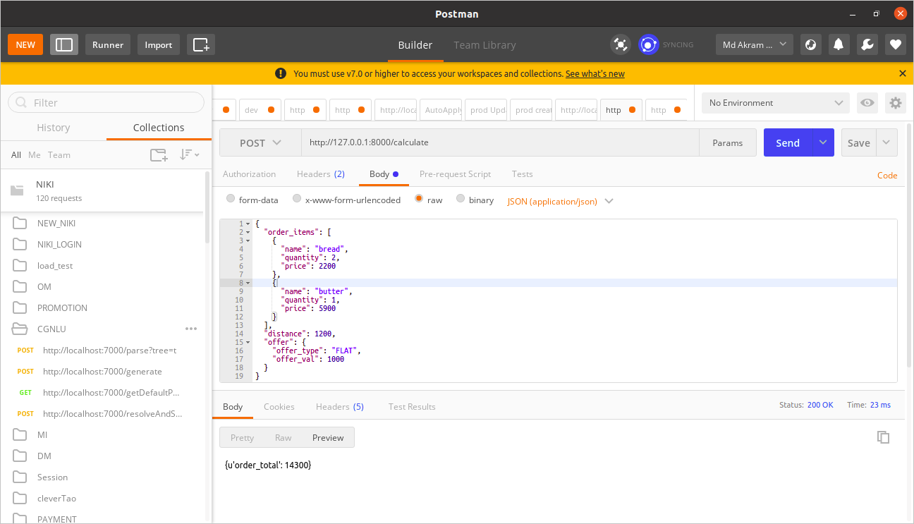
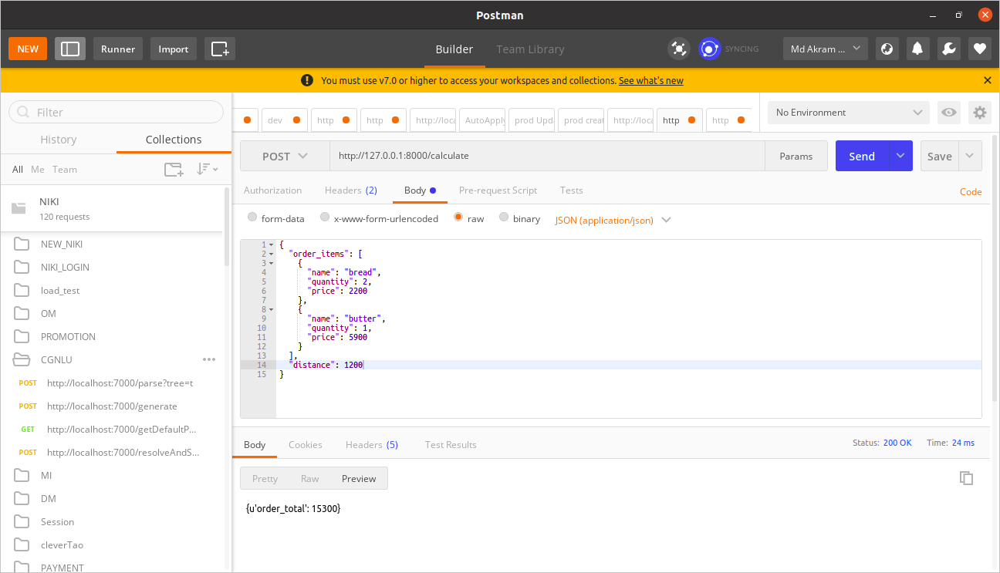
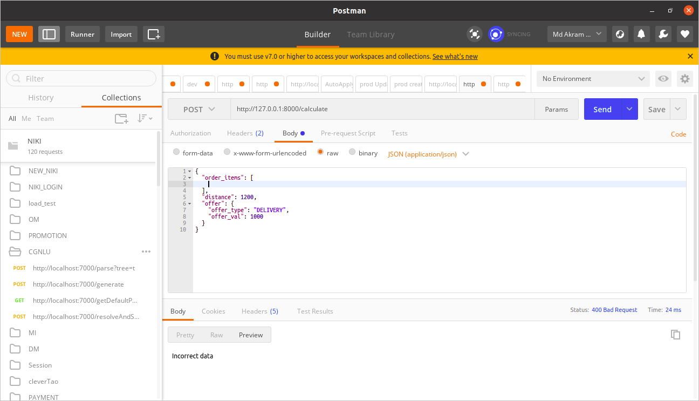

# Delivery Cost Calculator

## Setup

#### Docker

1. Go to project root directory
2. Build docker image using command 

    `docker build . -t delivery-cost`

    > This will create a docker image

4. Run container

    `docker run -d -p 8000:8000 delivery-cost`

#### Standalone

1. Go to project root directory
2. Create a virtual environment

    `virtualenv localenv`

3. Activate virtualenv

    `source localenv/bin/activate`

4. Install dependencies using command

    `pip install -r requirements.txt`

5. Start the application using command

    `python manage.py runserver`

## Working

- Send a POST request through postman or client URL (cURL)
    > Endpoint: http://127.0.0.1:8000/calculate

- Sample request JSON:
    ``` 
    {
        "order_items": [
            {
            "name": "bread",
            "quantity": 2,
            "price": 2200
            },
            {
            "name": "butter",
            "quantity": 1,
            "price": 5900
            }
        ],
        "distance": 1200,
        "offer": {
            "offer_type": "FLAT",
            "offer_val": 1000
        }
    }
    ```

- Sample response JSON:
    ```
    {'order_total':14300}
    ```

## Screenshots








### Explanation

1. System comprises for 2 parts.
    1. Order
    2. Config

#### 1.1 Order

Order will handle all the business logics to apply the delivery cost.
It will read the input data from request body and applies the delivery charges and offer(if any) on the input cart items.

#### 1.2 Config

Config contains the delivery slab data. Which specifies what charges that are applicable on the distance specified in the request body.
